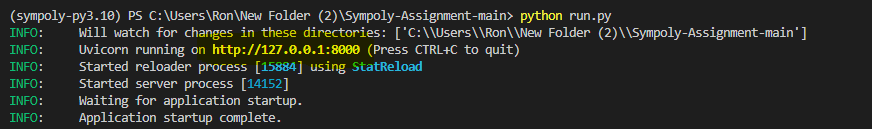
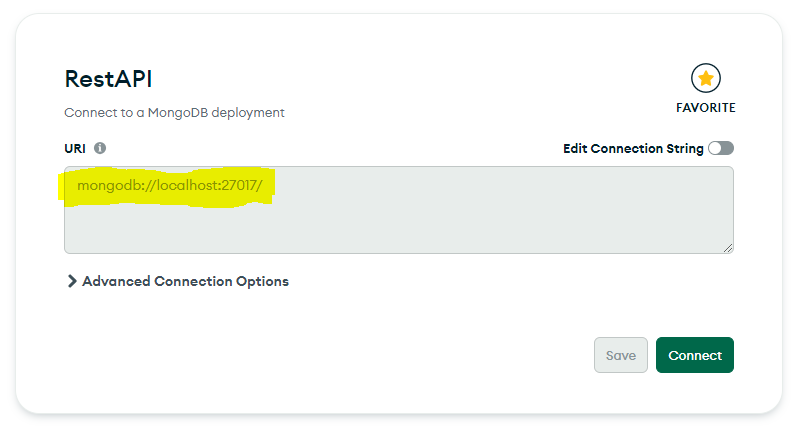
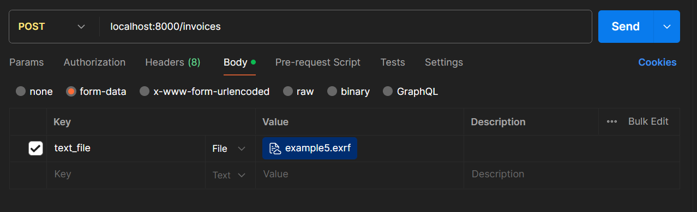

# Instructions

## Activate virutal ENV

After downloading the code from github insert those lines to the terminal:

1. poetry install
2. poetry shell
3. python run.py

The terminal will show that the app in running on localhost.

Example: " INFO: Uvicorn running on http://127.0.0.1:8000...."
Image: 

## Create mongoDB database

Go to mongoDB compass and create a new local database.
Get the database URL and insert it in database.py to the mongoDB variable.
Example: "mongodb://localhost:27017"

## Sending requests via Postman

Create new requests with this url: "<the app url>/invoices"

Example: "http://127.0.0.1:8000/invoices" or "localhost:8000/invoices"
Image: 

Those three requests will work without any additional requirements:

- `GET /invoices` - Return a list of all the invoices in the database.
- `GET /invoices/{invoice_id}` - Return a single invoice by its id.
- `DELETE /invoices/{invoice_id}` - Delete a single invoice by its id.

But these one will need a few requirements:

- `POST /invoices` - Upload a new .exrf file, parse it, save it to the database and return the parsed data.

With this post request go to Body ->
Choose the form-data option ->
Add a new key named: text_file ->
Choose the File option ->
And in the Value upload the exrf file

Image: 

Now the post request to create new parsed data will work.
